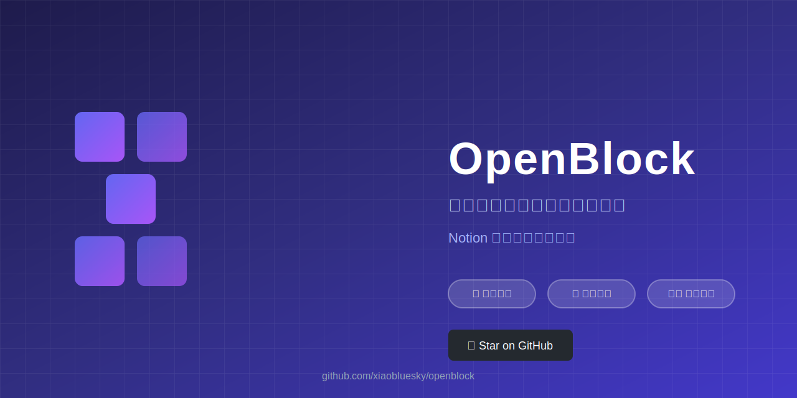
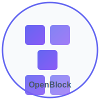

# OpenBlock 🧱

> 本地优先的开源知识工作空间 —— Notion 的隐私友好替代品



[](https://opensource.org/licenses/MIT)
[](https://github.com/xiaobluesky/openblock)
[](CONTRIBUTING.md)
[](https://vercel.com)

**中文** | [English](README.en.md)

---

## 📖 简介

OpenBlock 是一个**本地优先**、**数据开放**的知识管理工具，为你提供类似 Notion 的块编辑体验，但数据完全掌握在你手中。



### ✨ 核心特性

- 🏠 **本地优先** - 离线可用，数据存储在本地
- 🔓 **开放格式** - Markdown + JSON，随时导出迁移
- 🔄 **可选同步** - WebDAV/S3/WebRTC，自托管同步
- 🇨🇳 **中文优化** - 原生中文支持，无网络延迟
- 🛡️ **隐私保护** - 无数据收集，端到端加密可选
- 🧩 **插件系统** - 开源插件架构，自由扩展

---

## 🎯 为什么选择 OpenBlock？

| 功能 | OpenBlock | Notion | Obsidian |
|------|-----------|--------|----------|
| 块编辑器 | ✅ | ✅ | ❌ (Markdown) |
| 离线优先 | ✅ | ❌ | ✅ |
| 数据开放 | ✅ | ❌ | ✅ |
| 自托管同步 | ✅ | ❌ | ⚠️ (付费) |
| 中文优化 | ✅ | ⚠️ | ⚠️ |
| 免费 | ✅ | ❌ | ✅ |
| 开源 | ✅ | ❌ | ❌ |

---

## 🚀 快速开始

### 🌐 在线 Demo

访问我们的 [Vercel Demo](https://openblock.vercel.app) 体验最新版本！

### 安装 (开发中)

```bash
# 从源码构建
git clone https://github.com/xiaobluesky/openblock.git
cd openblock
npm install
npm run dev
```

### Docker 部署 (计划中)

```bash
docker run -d -p 3000:3000 -v ./data:/app/data openblock/openblock:latest
```

---

## 📦 技术栈

```
前端：React 18 + TypeScript + TipTap (块编辑器)
状态：Zustand + Yjs (CRDT 同步)
存储：SQLite (本地) + IndexedDB (缓存)
后端：Node.js + Express (可选同步服务)
部署：Docker + Vite (构建)
```

---

## 🗺️ 开发路线图

### Phase 1 - MVP (当前阶段) 🎯
- [x] 项目初始化
- [ ] 块编辑器核心 (TipTap 集成)
- [ ] 基础块类型 (文本/待办/代码/标题)
- [ ] 本地存储 (SQLite)
- [ ] 页面树形导航
- [ ] Markdown 导出

### Phase 2 - Beta (4-8 周)
- [ ] 图片/文件上传
- [ ] 全文搜索
- [ ] 主题系统 (深色模式)
- [ ] 基础插件 API

### Phase 3 - 1.0 (8-12 周)
- [ ] 同步服务 (WebDAV/S3)
- [ ] 协作编辑 (Yjs + WebRTC)
- [ ] 模板系统
- [ ] 移动端适配

---

## 🤝 贡献指南

我们欢迎所有形式的贡献！详见 [CONTRIBUTING.md](CONTRIBUTING.md)

### 开发环境设置

```bash
# 克隆项目
git clone https://github.com/xiaobluesky/openblock.git

# 安装依赖
npm install

# 启动开发服务器
npm run dev

# 运行测试
npm test
```

### 提交规范

- `feat:` 新功能
- `fix:` 修复 bug
- `docs:` 文档更新
- `style:` 代码格式
- `refactor:` 重构
- `test:` 测试相关
- `chore:` 构建/工具

---

## 📄 许可证

MIT License - 详见 [LICENSE](LICENSE)

---

## ⚖️ 法律声明

OpenBlock 是独立开发的开源项目，与 Notion Labs Inc. 无任何关联。

- 本项目采用 **Clean Room Design**，未参考任何专有源代码
- 所有代码均为原创实现
- 块编辑器概念为通用 UI 模式，不属于任何公司专利
- 项目名称、Logo 均为原创设计

---

## 📬 联系方式

- GitHub Issues: [问题反馈](https://github.com/xiaobluesky/openblock/issues)
- 讨论区：[GitHub Discussions](https://github.com/xiaobluesky/openblock/discussions)

---

<div align="center">

**如果 OpenBlock 对你有帮助，请给个 ⭐ Star！**

_数据应该属于用户，而不是公司。_

</div>
